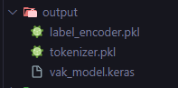

# Descripción del Proyecto

Este proyecto tiene como objetivo clasificar el estilo de aprendizaje VAK de los estudiantes por medio del procesamiento de lenguaje natural y una red neurnal de clasificación. El modelo está diseñado para analizar las expresiones escritas que dan indicios del estilo de aprendizaje a la que los estudinates están acostumbrados o prefieren utilizar para que de ese modo los docentes puedan conocerlos mejor y diseñar sesiones de mejor calidad que desembocarán en un mejor rendimiento académico.
# Instrucciones para la instalación y ejecución

## 1. Activacion del entorno de python venv
En windows
```bash
python -m venv venv  #Primero se crea el entorno     
venv/Scripts/activate #Despues se activa
```

## 2. Instalación de dependencias

Para instalar las dependencias necesarias, ejecute el siguiente comando:

```bash
pip install -r requirements.txt
```

## 3. Ejecucion del entrenamiento y validación del modelo para generar el modelo joblib y los encoders de las variables categoricas

Tener en cuenta que el modelo entrenado ya se encuentra en el repositorio, pero si por alguna razón no esta disponible, ejecute este script para realizar el entrenamiento y la generación del modelo entrenado con Keras.
```bash
python -m app.ml_models.model_training_service
```
Se debe comprobar que se hayan generado estos 3 archivos si es que no existen.




## 4. Ejecución del servidor REST

Para ejecutar el proyecto en el puerto 8000, utilice el siguiente comando:

```bash
uvicorn app.main:app --host 0.0.0.0 --port 8000
```

Asegúrese de que `uvicorn` esté instalado y configurado correctamente en su entorno.
